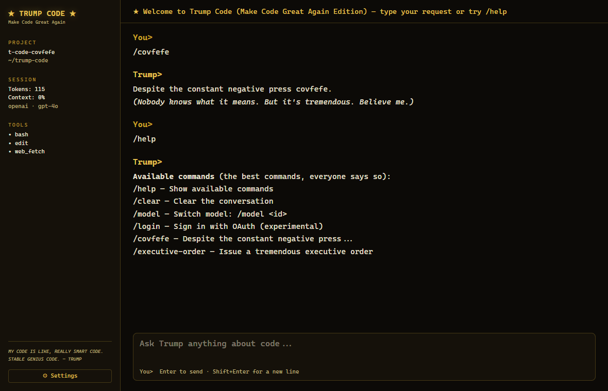

# ★ TRUMP CODE ★

### *Make Code Great Again*

The greatest AI coding assistant ever built. Maybe ever. A lot of people are saying it. It's a desktop app — Windows, macOS, the best operating systems — that takes YOUR API key (OpenAI, Anthropic, xAI, all the winners) and gives you **tremendous code** wrapped in the one, the only, **Trump voice**.

And while it thinks? Little ASCII Trumps. Thinking. Tremendously.

<p align="center">
  
  
  
  
  
</p>

<p align="center">
  
</p>

> *"BELIEVE ME, NOBODY UNDERSTANDS CODE BETTER THAN I DO."* — Trump Code

---

## 🏆 Tremendous Features

- **Multi-provider, no favorites (well, a few).** OpenAI, Anthropic (Claude), and xAI (Grok). You bring the key, we bring the winning.
- **The faces.** A row of hand-picked ASCII Trumps appears while the model thinks — *"tremendous thinking…"*, *"this is easy, believe me"*, *"almost done… it's going to be beautiful."* The signature. Accept no imitations.
- **Maximum voice, REAL answers.** The tone is 100% Trump. The code underneath is genuinely correct and useful. We don't sacrifice correctness for the bit. That would be a disaster. Sad.
- **Syntax-highlighted code blocks** with one-click copy. Clean. Strong.
- **Mar-a-Lago Gold** theme. Black and gold. Luxury. Like the jet.
- **Multiple saved sessions.** Your conversations, saved locally. Nobody touches them.
- **Keys in the OS keychain** — Windows Credential Manager / macOS Keychain. Not lying around in some file like a loser.
- **Easter eggs.** `/covfefe`. `/executive-order`. You'll see.

---

## 📜 Slash Commands

| Command | What it does |
| --- | --- |
| `/help` | The best commands. All of them. |
| `/clear` | Wipe the conversation. Fresh start. |
| `/model <id>` | Switch model. Big league. |
| `/login` | OAuth sign-in *(experimental — see below)* |
| `/covfefe` | Despite the constant negative press… |
| `/executive-order` | Issue a tremendous decree |

---

## 🚀 Install & Build

You need **Node 18+** and the **Rust toolchain** ([rustup.rs](https://rustup.rs)).

```bash
git clone https://github.com/imaflytok/t-code-covfefe.git
cd t-code-covfefe
npm install

# run it in dev (opens the desktop window)
npm run tauri dev

# build installers for your OS (.msi/.exe on Windows, .dmg on macOS)
npm run tauri build
```

Then open **⚙ Settings**, pick your provider, paste your API key, and start winning.

> **Where do I get a key?**
> - OpenAI → https://platform.openai.com/api-keys
> - Anthropic → https://console.anthropic.com/
> - xAI → https://console.x.ai/

---

## ⚠️ About OAuth (a.k.a. "log in with my subscription")

OAuth login for **Anthropic** and **ChatGPT/Codex** is **experimental** and **off by default**.

Here's the honest truth, because we don't do fake news:

- Those subscription logins are **first-party flows** (the ones Claude Code and Codex use). Using them from a third-party app like this one is **unofficial** and a **Terms-of-Service gray area**.
- They can break at any time, and in the worst case could get an account flagged.
- **API keys are the recommended, supported, ToS-clean path.** Use them unless you really know what you're doing.

You've been warned, folks. Tremendous warning. The best warning.

---

## 🛠️ Tech

Tauri 2 (Rust core) · React + Vite + TypeScript · Tailwind · Zustand · Vitest. Network calls and secrets live in the Rust core (native HTTP = no CORS, keychain for secrets).

```bash
npm test        # run the unit suite
npm run build   # typecheck + build the web bundle
```

---

## 🤝 Contributing

Only the best PRs. Believe me. Open an issue, keep tests green (`npm test`), keep it simple and strong. Tremendous contributions only.

## 📄 License

MIT. Free. The best price. See [LICENSE](LICENSE).

---

<sub>Trump Code is a parody/satire project and is not affiliated with, endorsed by, or associated with Donald J. Trump, OpenAI, Anthropic, or xAI. All trademarks belong to their respective owners. Use your own API keys and comply with each provider's Terms of Service.</sub>
